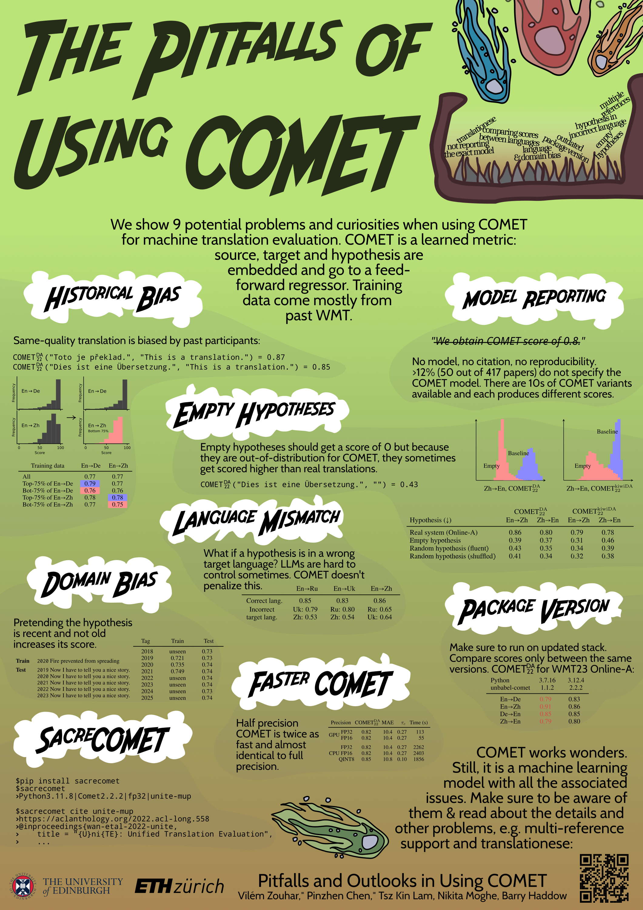

# SacreCOMET

> Since its introduction, the COMET metric has blazed a trail in the machine translation community, given its strong correlation with human judgements of translation quality. Its success stems from being a modified pre-trained multilingual model finetuned for quality assessment. However, it being a machine learning model also gives rise to a new set of pitfalls that may not be widely known. We investigate these unexpected behaviours from three aspects: 1) technical: obsolete software versions and compute precision; 2) data: empty content, language mismatch, and translationese at test time as well as distribution and domain biases in training; 3) usage and reporting: multi-reference support and model referencing in the literature. All of these problems imply that COMET scores is not comparable between papers or even technical setups and we put forward our perspective on fixing each issue. Furthermore, we release the SacreCOMET package that can generate a signature for the software and model configuration as well as an appropriate citation. The goal of this work is to help the community make more sound use of the COMET metric.

Read the full paper [Pitfalls and Outlooks in Using COMET](https://arxiv.org/abs/2408.15366).

## Tool

The Python tool has two functionalities.
First, it creates a signature with your setup and COMET model:

```
pip install sacrecomet

# Without anything will try to detect the local environment and will
# ask you questions about which COMET model you used.
# Example output: Python3.11.8|Comet2.2.2|fp32|unite-mup

sacrecomet 

# Arguments can also be specified non-interactively:

sacrecomet --model unite-mup --prec fp32
```

The other functionality is to find specific citations for COMET models that you're using:

```
sacrecomet cite --model Unbabel/xcomet-xl

https://arxiv.org/abs/2310.10482
@misc{guerreiro2023xcomet,
    title={xCOMET: Transparent Machine Translation Evaluation through Fine-grained Error Detection}, 
    ...
```

You can also list all the available models:
```
sacrecomet list

unbabel/wmt24-qe-task2-baseline
unbabel/wmt22-cometkiwi-da
unbabel/xcomet-xl
unbabel/xcomet-xxl
unbabel/towerinstruct-13b-v0.1
unbabel/towerinstruct-7b-v0.2
unbabel/towerbase-7b-v0.1
...
```

## Experiments

Documentation TODO

## Paper

Cite as:

```
@misc{zouharchen2024sacrecomet,
      title={Pitfalls and Outlooks in Using COMET}, 
      author={Vilém Zouhar and Pinzhen Chen and Tsz Kin Lam and Nikita Moghe and Barry Haddow},
      year={2024},
      eprint={2408.15366},
      archivePrefix={arXiv},
      primaryClass={cs.CL},
      url={https://arxiv.org/abs/2408.15366}, 
}
```



## Changelog

- v0.1.0 (30 October 2024):
  - Add `list` command to list available models
  - Add references usage to the SacreCOMET usage.
  - Deprecate `sacrecomet cite model_name` positional model name specification. Citations now have to explicitly use the `--model` argument.
- v0.0.1 (7 August 2024)
  - First release